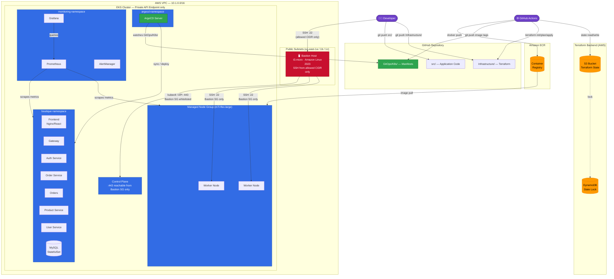

# Boutique E-Commerce Platform — DevOps & AIOps Infrastructure

A production-grade, cloud-native microservices platform deployed on AWS EKS with a fully automated CI/CD pipeline, GitOps-driven continuous delivery via ArgoCD, and secured private infrastructure accessible only through a bastion host.

---

## Architecture Overview



---

## Security Model

| Boundary | Rule |
|---|---|
| EKS API endpoint | **Private only** — no public endpoint. Reachable only from within the VPC. |
| EKS API access within VPC | Additional security group on the control plane allows **port 443 from the bastion SG only**. |
| Worker node SSH | `remote_access` on the node group allows **port 22 from the bastion SG only**. |
| Bastion SSH | Inbound port 22 from **your `allowed_ssh_cidr` only** (set in `terraform.tfvars`). |
| Terraform state | S3 bucket with **versioning + server-side encryption**. DynamoDB table for state locking. |
| Container images | ECR repositories with **image scanning on push** enabled. |

---

## Repository Structure

```
.
├── .github/workflows/
│   ├── terraform.yml          # Terraform plan + apply pipeline
│   ├── CI.yml                 # Full rebuild — all services at once (manual)
│   ├── ci-auth.yml            # Per-service CI (triggers on src/backend/services/auth/**)
│   ├── ci-frontend.yml        # Per-service CI (triggers on src/frontend/**)
│   ├── ci-gateway.yml
│   ├── ci-order-service.yml
│   ├── ci-orders.yml
│   ├── ci-product-service.yml
│   └── ci-user-service.yml
│
├── Infrastructure/            # Terraform — provisions all AWS resources
│   ├── backend.tf             # S3 remote state backend
│   ├── main.tf                # Root module — wires vpc, bastion, eks, ecr, argocd
│   ├── provider.tf            # AWS / Kubernetes / Helm providers
│   ├── variables.tf
│   ├── terraform.tfvars
│   └── modules/
│       ├── vpc/               # VPC, subnets, IGW, route tables
│       ├── bastion/           # EC2 bastion host + security group
│       ├── eks/               # EKS cluster, node group, OIDC, EBS CSI
│       ├── ecr/               # ECR repositories (one per service)
│       └── argocd/            # ArgoCD + kube-prometheus-stack (Helm)
│
├── GitOps/                    # ArgoCD watches this directory
│   ├── ArgoCD/
│   │   └── argo-cd.yml        # ArgoCD Application manifest
│   ├── K8s/
│   │   ├── backend/           # Deployment manifests for all backend services
│   │   ├── frontend/          # Frontend deployment
│   │   └── database/          # MySQL StatefulSet + init jobs
│   ├── kustomization.yml
│   ├── namespace.yml
│   └── secrets.yml
│
├── Observability/
│   ├── prometheus/            # Prometheus scrape config
│   └── grafana/               # Grafana datasource provisioning
│
└── src/                       # Application source code
    ├── frontend/              # React + TypeScript (Nginx)
    └── backend/services/
        ├── auth/              # Authentication service (Node.js)
        ├── gateway/           # API Gateway
        ├── order-service/
        ├── orders/
        ├── product-service/
        └── user-service/
```

---

## Infrastructure (Terraform)

Terraform provisions the complete AWS environment. State is stored remotely in S3 with DynamoDB locking — no local state files.

### Resources created

| Module | Resources |
|---|---|
| **vpc** | VPC (`10.1.0.0/16`), 3 public subnets across AZs, Internet Gateway, route tables |
| **bastion** | EC2 `t3.micro` (Amazon Linux 2023), Elastic IP, security group (SSH from your IP only) |
| **eks** | EKS 1.34 cluster (private endpoint), managed node group (`m7i-flex.large`), OIDC provider, EBS CSI driver, IAM roles |
| **ecr** | 7 private ECR repositories (one per microservice) with image scanning |
| **argocd** | `argocd` and `monitoring` namespaces, ArgoCD v6.7.0, kube-prometheus-stack v56.21.0 |

### Before first apply

**Step 1** — Create an S3 bucket and DynamoDB table for Terraform state:

```bash
# S3 bucket (versioning + encryption required)
aws s3api create-bucket --bucket my-project-tf-state --region us-east-1
aws s3api put-bucket-versioning --bucket my-project-tf-state \
  --versioning-configuration Status=Enabled
aws s3api put-bucket-encryption --bucket my-project-tf-state \
  --server-side-encryption-configuration \
  '{"Rules":[{"ApplyServerSideEncryptionByDefault":{"SSEAlgorithm":"AES256"}}]}'

# DynamoDB table (partition key must be LockID)
aws dynamodb create-table \
  --table-name my-project-tf-locks \
  --attribute-definitions AttributeName=LockID,AttributeType=S \
  --key-schema AttributeName=LockID,KeyType=HASH \
  --billing-mode PAY_PER_REQUEST
```

**Step 2** — Create an EC2 key pair:

Go to **AWS Console → EC2 → Key Pairs → Create key pair**.  
Name it `eks-bastion-key` (matches `terraform.tfvars`). Download the `.pem` file.

**Step 3** — Update `Infrastructure/terraform.tfvars`:

```hcl
key_name         = "eks-bastion-key"
allowed_ssh_cidr = "YOUR.IP.ADDRESS/32"   # curl ifconfig.me
```

**Step 4** — Set GitHub Secrets:

| Secret | Value |
|---|---|
| `AWS_ACCESS_KEY_ID` | IAM user access key |
| `AWS_SECRET_ACCESS_KEY` | IAM user secret key |
| `AWS_REGION` | `us-east-1` |
| `AWS_ACCOUNT_ID` | 12-digit AWS account ID |
| `TF_STATE_BUCKET` | S3 bucket name from Step 1 |
| `TF_STATE_DYNAMODB_TABLE` | DynamoDB table name from Step 1 |

---

## CI/CD Pipeline

### Continuous Integration (GitHub Actions)

Each service has its own pipeline that triggers **only when that service's code changes**:

| Pipeline | Trigger path |
|---|---|
| `ci-auth.yml` | `src/backend/services/auth/**` |
| `ci-gateway.yml` | `src/backend/services/gateway/**` |
| `ci-orders.yml` | `src/backend/services/orders/**` |
| `ci-order-service.yml` | `src/backend/services/order-service/**` |
| `ci-product-service.yml` | `src/backend/services/product-service/**` |
| `ci-user-service.yml` | `src/backend/services/user-service/**` |
| `ci-frontend.yml` | `src/frontend/**` |

Each pipeline:
1. Builds the Docker image from the service's `Dockerfile`
2. Pushes to ECR with two tags: `:<git-sha>` and `:latest`
3. Updates the image tag in `GitOps/K8s/` and pushes the commit

`CI.yml` (manual via `workflow_dispatch`) rebuilds **all** services at once — useful after a base image update.

### Continuous Deployment (ArgoCD)

ArgoCD runs inside the EKS cluster and watches the `GitOps/K8s/` directory. When the CI pipeline pushes an updated image tag to a manifest, ArgoCD detects the diff and automatically syncs the deployment.

```
Code push → GitHub Actions builds image → pushes to ECR
                                        → updates GitOps/K8s/ manifest
                                                        ↓
                                        ArgoCD detects change → kubectl apply → rolling update
```

### Terraform Pipeline

The `terraform.yml` pipeline runs on any push to `Infrastructure/**`:

| Job | Trigger | Action |
|---|---|---|
| `terraform-plan` | PR or push | `fmt` check, `validate`, `plan` (posted as PR comment) |
| `terraform-apply` | Merge to `main` | Downloads saved plan artifact → `apply` (gated by `production` environment) |

> **Note:** Because the EKS API is private-only, `terraform apply` for the ArgoCD Helm release must be run from the bastion after initial cluster creation. The VPC/EKS/ECR/bastion resources themselves apply from CI without issue.

---

## Connecting to the Cluster

All kubectl access goes through the bastion. There is no public EKS API endpoint.

```bash
# 1. SSH into the bastion (IP shown in Terraform output)
ssh -i eks-bastion-key.pem ec2-user@$(terraform output -raw bastion_public_ip)

# 2. Configure kubectl on the bastion
aws eks update-kubeconfig --region us-east-1 --name eks-cluster

# 3. Verify
kubectl get nodes
kubectl get pods -A

# 4. Access ArgoCD UI via port-forward from bastion
kubectl port-forward svc/argocd-server -n argocd 8080:80
# Then SSH tunnel from your laptop:
# ssh -L 8080:localhost:8080 -i eks-bastion-key.pem ec2-user@<bastion-ip>
# Open: http://localhost:8080
```

---

## Observability

The `kube-prometheus-stack` Helm chart deploys the full monitoring stack into the `monitoring` namespace:

| Component | Purpose |
|---|---|
| **Prometheus** | Scrapes metrics from all pods and nodes via `ServiceMonitor` CRDs |
| **Grafana** | Dashboards — pre-provisioned with Prometheus as datasource |
| **AlertManager** | Alert routing and notification |

All services expose a `ServiceMonitor` (`GitOps/K8s/backend/service-monitor.yml`) for automatic Prometheus discovery.

Access Grafana via the same port-forward + SSH tunnel pattern as ArgoCD.

---

## Microservices

| Service | Port | Description |
|---|---|---|
| `frontend` | 80 | React/TypeScript storefront served by Nginx |
| `gateway` | — | API Gateway — single entry point for all backend calls |
| `auth` | 3002 | JWT-based authentication and authorisation |
| `user-service` | — | User profile management |
| `product-service` | — | Product catalogue |
| `order-service` | — | Order creation and management |
| `orders` | — | Order query service |
| `mysql` | 3306 | MySQL StatefulSet with persistent EBS volume |
