# Boutique E-Commerce Platform — GitOps Infrastructure

A production-grade, cloud-native microservices platform on AWS EKS with fully automated CI/CD, GitOps delivery via ArgoCD, private networking with NAT, a public ALB fronted by Route 53, and security enforced at every layer.

---

## Architecture Overview

```mermaid
graph TB
    Dev([👨‍💻 Developer])
    GHA([⚙️ GitHub Actions])
    User([🌍 End User])

    subgraph TF_BACKEND["Terraform Backend"]
        S3[(S3\nTF State)]
        DDB[(DynamoDB\nState Lock)]
    end

    subgraph DNS["Route 53"]
        R53[boutique.example.com\nAlias → ALB]
    end

    subgraph ECR_BOX["Amazon ECR"]
        ECR[(Container\nRegistry)]
    end

    subgraph VPC["AWS VPC  —  10.1.0.0/16"]

        IGW[🌐 Internet Gateway]

        subgraph PUB["Public Subnets  10.1.1-3.0/24  (us-east-1a / 1b / 1c)"]
            BASTION["🔒 Bastion Host\nt3.micro · SSH from allowed CIDR only"]
            NAT["🔁 NAT Gateway\n+ Elastic IP"]
            ALB["⚖️ Application Load Balancer\nHTTPS :443  HTTP :80→443"]
        end

        subgraph PRIV["Private Subnets  10.1.10-12.0/24  (us-east-1a / 1b / 1c)"]

            subgraph EKS["EKS Cluster  —  Private API Endpoint only"]
                CP["Control Plane\n:443 · Bastion SG only"]

                subgraph NODES["Node Group  m7i-flex.large  (private subnets)"]
                    N1[Worker Node]
                    N2[Worker Node]
                end

                subgraph SYS_NS["kube-system"]
                    LBC[AWS LBC\nCreates ALB]
                    EDNS[external-dns\nUpdates Route 53]
                end

                subgraph ARGOCD_NS["argocd"]
                    ACD[ArgoCD Server]
                end

                subgraph MON_NS["monitoring"]
                    PROM[Prometheus]
                    GRAF[Grafana]
                    ALERT[AlertManager]
                end

                subgraph APP_NS["boutique"]
                    FE[Frontend\nNginx/React]
                    GW[Gateway]
                    AUTH[Auth]
                    PS[Product\nService]
                    OS[Order\nService]
                    US[User\nService]
                    DB[(MySQL\nStatefulSet)]
                end
            end
        end
    end

    subgraph REPO["GitHub Repository"]
        SRC[src/]
        GITOPS[GitOps/K8s/]
        INFRA[Infrastructure/]
    end

    %% User flow
    User -->|"HTTPS"| R53
    R53 -->|"Alias"| ALB
    ALB -->|"HTTP target-type: ip"| FE
    ALB -->|"HTTP /api"| GW

    %% Internet → VPC
    IGW --> PUB

    %% Public subnet outbound
    NAT -->|"outbound only"| IGW

    %% Private subnet outbound via NAT
    NODES -->|"ECR pulls\nAWS API calls"| NAT

    %% Bastion
    Dev -->|"SSH :22\nallowed CIDR only"| BASTION
    BASTION -->|"kubectl :443\nBastion SG only"| CP
    BASTION -->|"SSH :22\nBastion SG only"| N1

    %% GitHub Actions CI
    GHA -->|"docker push\nTrivy + Cosign"| ECR
    GHA -->|"git push image tags"| GITOPS
    GHA -->|"terraform plan/apply"| INFRA
    GHA -->|"state"| S3
    S3 -.->|lock| DDB

    %% ECR → Nodes (via NAT)
    ECR -->|"image pull"| NODES

    %% ArgoCD GitOps
    ACD -->|"watches"| GITOPS
    ACD -->|"sync"| APP_NS

    %% LBC + external-dns
    LBC -->|"provisions"| ALB
    EDNS -->|"A record"| R53

    %% Observability
    PROM -->|"scrapes"| APP_NS
    PROM -->|"scrapes"| NODES
    GRAF -->|"queries"| PROM

    classDef secure fill:#c8102e,color:#fff,stroke:#8b0000
    classDef aws fill:#FF9900,color:#000,stroke:#e07b00
    classDef k8s fill:#326CE5,color:#fff,stroke:#1a4fa8
    classDef gitops fill:#2ea44f,color:#fff,stroke:#196c2e
    classDef ext fill:#6e40c9,color:#fff,stroke:#4a2a8c
    classDef net fill:#0d6efd,color:#fff,stroke:#084298

    class BASTION secure
    class S3,DDB,ECR aws
    class ALB,NAT,IGW net
    class CP,NODES,SYS_NS,ARGOCD_NS,MON_NS,APP_NS k8s
    class ACD,GITOPS gitops
    class Dev,GHA,User ext
    class R53 aws
```



---

## Security Model

| Boundary | Rule |
|---|---|
| **EKS API endpoint** | Private only — no public endpoint. Reachable only from within the VPC. |
| **EKS API within VPC** | Additional SG on control plane ENIs allows port 443 from the bastion SG only. |
| **Worker nodes** | In private subnets — no inbound from internet. SSH only from bastion SG. |
| **Bastion SSH** | Inbound port 22 from `allowed_ssh_cidr` only (set in `terraform.tfvars`). |
| **Internet → pods** | ALB → pods only. No direct node/pod exposure. |
| **Pod → internet** | Via NAT Gateway only — no public IPs on nodes. |
| **Pod → pod** | Network policies: default-deny-all, explicit allow within `boutique` namespace. |
| **Pod DNS** | Explicit egress allow to kube-system:53 (CoreDNS). |
| **Terraform state** | S3 with versioning + AES-256 encryption. DynamoDB state locking. |
| **Container images** | ECR with image scanning on push. Trivy scan in CI. Cosign signatures. |
| **Route 53** | external-dns manages records automatically from Ingress annotations. |

---

## Repository Structure

```
.
├── .github/workflows/
│   ├── terraform.yml            # plan + apply with manual approval gate
│   ├── CI.yml                   # full rebuild — all services (manual)
│   ├── ci-auth.yml              # per-service: build → Trivy → push → Cosign sign → manifest update
│   ├── ci-frontend.yml
│   ├── ci-gateway.yml
│   ├── ci-order-service.yml
│   ├── ci-orders.yml
│   ├── ci-product-service.yml
│   └── ci-user-service.yml
│
├── Infrastructure/
│   ├── backend.tf               # S3 remote state
│   ├── main.tf                  # root module wiring
│   ├── provider.tf              # AWS / Kubernetes / Helm providers
│   ├── variables.tf
│   ├── terraform.tfvars
│   ├── outputs.tf
│   └── modules/
│       ├── vpc/                 # VPC, public/private subnets, IGW, NAT, route tables
│       ├── bastion/             # EC2 bastion + SG
│       ├── eks/                 # EKS cluster, node group, OIDC, EBS CSI, LBC IRSA, external-dns IRSA
│       ├── ecr/                 # ECR repositories
│       ├── argocd/              # ArgoCD, AWS LBC, external-dns, kube-prometheus-stack (Helm)
│       └── route53/             # Hosted zone
│
├── GitOps/
│   ├── ArgoCD/
│   │   └── argo-cd.yml
│   ├── K8s/
│   │   ├── ingress/
│   │   │   └── ingress.yml      # ALB Ingress — HTTPS, HTTP→HTTPS redirect, external-dns annotation
│   │   ├── network-policies/
│   │   │   ├── default-deny.yml          # deny all ingress+egress by default
│   │   │   ├── allow-internal.yml        # allow intra-namespace pod communication
│   │   │   ├── allow-ingress-controller.yml  # allow ALB → frontend/gateway
│   │   │   └── allow-dns-egress.yml      # allow CoreDNS queries
│   │   ├── backend/             # service deployment manifests
│   │   ├── frontend/
│   │   └── database/            # MySQL StatefulSet
│   ├── kustomization.yml
│   ├── namespace.yml
│   └── secrets.yml
│
├── Observability/
│   ├── prometheus/
│   └── grafana/
│
└── src/
    ├── frontend/
    └── backend/services/
        ├── auth/ · gateway/ · order-service/ · orders/ · product-service/ · user-service/
```

---

## Infrastructure (Terraform)

### Network Architecture

| Layer | CIDR | Contents |
|---|---|---|
| VPC | `10.1.0.0/16` | All resources |
| Public subnets | `10.1.1-3.0/24` | Bastion host, NAT Gateway, internet-facing ALB |
| Private subnets | `10.1.10-12.0/24` | EKS worker nodes, application pods |

Traffic flow:
- **Inbound:** Internet → IGW → ALB (public subnet) → pods (private subnet via target-type IP)
- **Outbound:** Pods → NAT Gateway (public subnet) → IGW → Internet (ECR pulls, AWS APIs)
- **Management:** Developer → Bastion (SSH) → EKS API (private endpoint)

### Terraform Modules

| Module | Resources |
|---|---|
| **vpc** | VPC, 3 public subnets, 3 private subnets, IGW, NAT Gateway + EIP, public + private route tables |
| **bastion** | EC2 `t3.micro` (Amazon Linux 2023), SG (SSH from allowed CIDR only) |
| **eks** | EKS 1.34 (private endpoint), managed node group in private subnets, OIDC, EBS CSI, LBC IRSA, external-dns IRSA |
| **ecr** | 7 private repositories with image scanning |
| **argocd** | ArgoCD v6.7.0, AWS Load Balancer Controller v1.7.2, external-dns v1.14.3, kube-prometheus-stack v56.21.0 |
| **route53** | Hosted zone for your domain |

### Before First Apply

**Step 1 — Terraform state backend:**
```bash
aws s3api create-bucket --bucket my-tf-state --region us-east-1
aws s3api put-bucket-versioning --bucket my-tf-state \
  --versioning-configuration Status=Enabled
aws s3api put-bucket-encryption --bucket my-tf-state \
  --server-side-encryption-configuration \
  '{"Rules":[{"ApplyServerSideEncryptionByDefault":{"SSEAlgorithm":"AES256"}}]}'
aws dynamodb create-table \
  --table-name my-tf-locks \
  --attribute-definitions AttributeName=LockID,AttributeType=S \
  --key-schema AttributeName=LockID,KeyType=HASH \
  --billing-mode PAY_PER_REQUEST
```

**Step 2 — EC2 key pair:** AWS Console → EC2 → Key Pairs → Create → name `eks-bastion-key`

**Step 3 — Update `terraform.tfvars`:**
```hcl
allowed_ssh_cidr = "YOUR.IP.ADDRESS/32"  # curl ifconfig.me
domain_name      = "boutique.yourdomain.com"
```

**Step 4 — GitHub Secrets:**

| Secret | Value |
|---|---|
| `AWS_ACCESS_KEY_ID` | IAM access key |
| `AWS_SECRET_ACCESS_KEY` | IAM secret key |
| `AWS_REGION` | `us-east-1` |
| `AWS_ACCOUNT_ID` | 12-digit AWS account ID |
| `TF_STATE_BUCKET` | S3 bucket name |
| `TF_STATE_DYNAMODB_TABLE` | DynamoDB table name |

**Step 5 — Apply order** (EKS private endpoint means argocd module runs from bastion):
```bash
# From CI — provisions VPC, EKS, ECR, bastion, Route 53
terraform apply -target=module.vpc -target=module.bastion \
                -target=module.eks -target=module.ecr -target=module.route53

# From bastion — deploys cluster add-ons (ArgoCD, LBC, external-dns, Prometheus)
ssh -i eks-bastion-key.pem ec2-user@<bastion-ip>
aws eks update-kubeconfig --region us-east-1 --name eks-cluster
terraform apply -target=module.argocd
```

**Step 6 — Point your domain:** after apply, update your registrar NS records:
```bash
terraform output route53_name_servers
```

**Step 7 — ACM Certificate:** request a certificate for your domain in ACM, validate via DNS (Route 53 makes this one click), then paste the ARN into `GitOps/K8s/ingress/ingress.yml`.

---

## CI/CD Pipeline

### Per-Service Pipelines (GitHub Actions)

Each service triggers independently when its code changes:

| Pipeline | Trigger |
|---|---|
| `ci-auth.yml` | `src/backend/services/auth/**` |
| `ci-gateway.yml` | `src/backend/services/gateway/**` |
| `ci-orders.yml` | `src/backend/services/orders/**` |
| `ci-order-service.yml` | `src/backend/services/order-service/**` |
| `ci-product-service.yml` | `src/backend/services/product-service/**` |
| `ci-user-service.yml` | `src/backend/services/user-service/**` |
| `ci-frontend.yml` | `src/frontend/**` |

Each pipeline:
1. Builds the Docker image
2. Scans with **Trivy** — reports CVEs to GitHub Security tab (non-blocking)
3. Pushes to ECR with `:<git-sha>` and `:latest` tags *(main only)*
4. Signs the image by digest with **Cosign** keyless signing *(main only)*
5. Updates `GitOps/K8s/` manifest with new image tag → ArgoCD syncs automatically

### GitOps Flow (ArgoCD)

```
Code push → CI builds → Trivy scan → push ECR → Cosign sign → update GitOps manifest
                                                                        ↓
                                                    ArgoCD detects diff → kubectl apply
                                                                        ↓
                                                    LBC updates ALB target groups
                                                                        ↓
                                             external-dns updates Route 53 if hostname changed
```

### Terraform Pipeline

| Job | When | Action |
|---|---|---|
| `terraform-plan` | PR or push | fmt, validate, plan — result posted as PR comment |
| `terraform-apply` | Merge to main | Downloads saved plan → apply (gated by `production` environment) |

---

## Supply Chain Security

### Trivy — Vulnerability Scanning

```
Build → aquasecurity/setup-trivy@v0.2.6 → trivy image --format sarif
      → Upload SARIF to GitHub Security tab
      → Pipeline continues regardless (non-blocking — known transitive CVEs)
```

### Cosign — Image Signing (Keyless)

After every push, the image is signed by digest using the GitHub Actions OIDC identity — no private key or secret required. The signature is stored in ECR as an OCI artifact.

```bash
# Verify any image
cosign verify \
  --certificate-identity-regexp "https://github.com/<org>/<repo>" \
  --certificate-oidc-issuer "https://token.actions.githubusercontent.com" \
  <account>.dkr.ecr.<region>.amazonaws.com/<service>@sha256:<digest>
```

---

## Kubernetes — Ingress & Network Policies

### Ingress (AWS ALB)

The `GitOps/K8s/ingress/ingress.yml` resource is picked up by the **AWS Load Balancer Controller** which provisions a real ALB in the public subnets. Traffic flow:

```
Internet → Route 53 → ALB (public subnet, HTTPS:443)
         → target-type: ip → pods (private subnet, HTTP:80)
```

Routing rules:
- `/api/*` and `/auth/*` → `gateway:80`
- `/*` → `frontend:80`

HTTP → HTTPS redirect is enforced at the ALB listener level.

### Network Policies

| Policy | Effect |
|---|---|
| `default-deny.yml` | Deny all ingress and egress in the `boutique` namespace by default |
| `allow-internal.yml` | Allow pod-to-pod traffic within the namespace (service mesh) |
| `allow-ingress-controller.yml` | Allow ALB → `frontend` and `gateway` pods |
| `allow-dns-egress.yml` | Allow all pods to query CoreDNS (UDP/TCP :53) |

---

## Connecting to the Cluster

All access goes through the bastion. There is no public EKS API endpoint.

```bash
# SSH to bastion
ssh -i eks-bastion-key.pem ec2-user@$(terraform output -raw bastion_public_ip)

# Configure kubectl
aws eks update-kubeconfig --region us-east-1 --name eks-cluster

# Verify
kubectl get nodes
kubectl get pods -A

# ArgoCD UI (port-forward + SSH tunnel)
kubectl port-forward svc/argocd-server -n argocd 8080:80
# On your laptop: ssh -L 8080:localhost:8080 -i eks-bastion-key.pem ec2-user@<bastion-ip>
# Open: http://localhost:8080

# Grafana UI (same pattern)
kubectl port-forward svc/kube-prometheus-stack-grafana -n monitoring 3000:80
```

---

## Observability

| Component | Purpose |
|---|---|
| **Prometheus** | Scrapes metrics from pods and nodes via `ServiceMonitor` CRDs |
| **Grafana** | Dashboards — Prometheus pre-provisioned as datasource |
| **AlertManager** | Alert routing and notification |

---

## Microservices

| Service | Port | Description |
|---|---|---|
| `frontend` | 80 | React/TypeScript storefront (Nginx) |
| `gateway` | 80 | API Gateway — single entry point for all backend calls |
| `auth` | 3002 | JWT authentication and authorisation |
| `user-service` | — | User profile management |
| `product-service` | — | Product catalogue |
| `order-service` | — | Order creation |
| `orders` | — | Order query service |
| `mysql` | 3306 | MySQL StatefulSet with EBS persistent volume |
